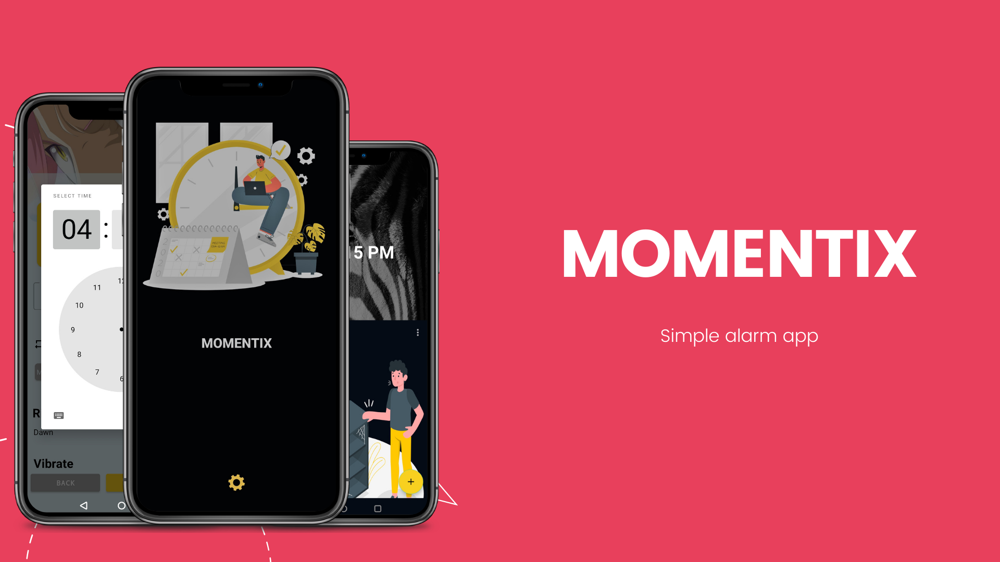
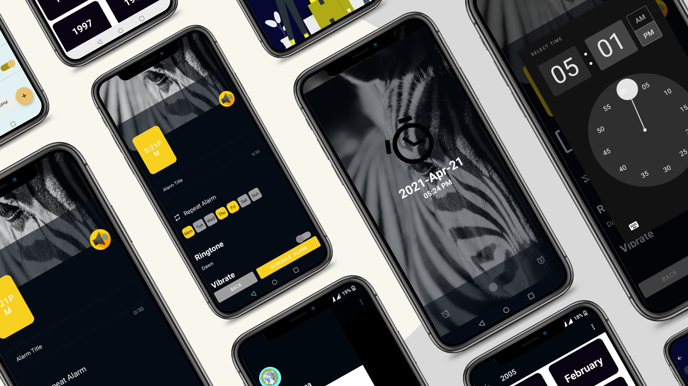
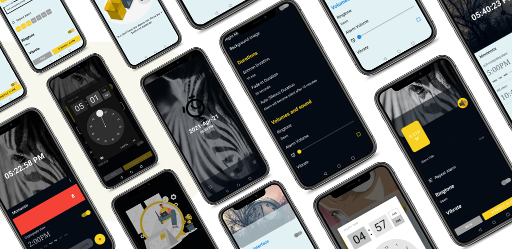

# Momentix

Momentix is a free alarm clock application designed to create, edit and remove alarms in the easiest way. You can use Momentix to wake up in the morning or set up reminders for your tasks during the day.
You can also edit or remove alarms with just one touch, saving a lot of time when you need to set up your alarms.

If you use Momentix to wake you up in the morning, you will be able to wake up gently from your dreams, in a peaceful and progressive way, because Momentix increases alarm volume slowly instead of starting at maximum volume. This way, you can avoid being startled by a loud sound while you are in a deep sleep.

Momentix lets you customize the alarm's sound (selecting any ringtone, sound or song in your phone) and many other settings.

If you want to wake up at the same time every day, on workdays, weekends or just a few days a week, you can easily select which days when creating the alarm, and the alarm clock will go off on that selected days every wee
# Download apk

 

  

# Technologies used

* [MVVM](https://developer.android.com/jetpack/guide?gclid=CjwKCAjwqIiFBhAHEiwANg9szhEQU8xNXU6Qc9Mk1igWc5Q4iKST31MFsBTihfn7Zo4g6HU0CAthFBoCpoIQAvD_BwE&gclsrc=aw.ds) Model-View-ViewModel (MVVM) is a structural design pattern that separates objects into model, view and view model.
* [Dagger-hilt](https://developer.android.com/training/dependency-injection/hilt-android) a dependency injection library for Android that reduces the boilerplate of doing manual dependency injection in your project.
* [Glide](https://github.com/bumptech/glide) a fast and efficient open source media management and image loading framework for Android.
* [LiveData](https://developer.android.com/topic/libraries/architecture/livedata) to handle data in a lifecycle-aware fashion.
* [Navigation Component](https://developer.android.com/guide/navigation) to handle all navigations and also passing of data between destinations.
* [Material Design](https://material.io/develop/android/docs/getting-started/) an adaptable system of guidelines, components, and tools that support the best practices of user interface design.
* [Coroutines](https://kotlinlang.org/docs/reference/coroutines-overview.html) used to manage the local storage i.e. `writing to and reading from the database`. Coroutines help in managing background threads and reduces the need for callbacks.
* [View Binding](https://developer.android.com/topic/libraries/view-binding) is feature that allows you to more easily write code that interacts with views.
* [Room](https://developer.android.com/topic/libraries/architecture/room) persistence library which provides an abstraction layer over SQLite to allow for more robust database access while harnessing the full power of SQLite.
* [Data Binding](https://developer.android.com/topic/libraries/data-binding/) to declaratively bind UI components in layouts to data sources.

# Features
- ✔️: Fast setup method.
- ✔️: Alarm enabling/disabling with one touch.
- ✔️:Set a message for each alarm.
- ✔️:Repeat alarms every week on certain days.
- ✔️:Select the alarm sound you want from all your phone's ringtones, songs and sounds. Wake up to your favourite music!
- ✔️:1 button alarm Snooze.
- ✔️: Wake up gently while volume and vibration increase slowly.
- ✔️: Night mode

# Screenshots

# Contribution
All contributions are welcome. If you are interested in seeing a particular feature implemented in this app, please open a new issue so after which you can make a PR!
